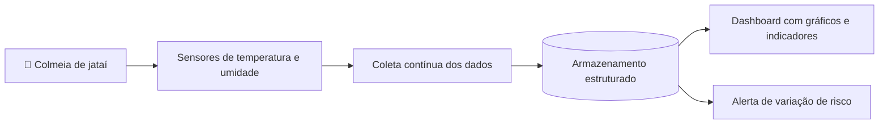

<h1 align="center">🐝 TETRIA</h1>
<h3 align="center">Monitorando colmeias</h3>

  <b>Colmeia Conectada:</b> um sistema de alerta por temperatura e umidade para a criação de abelhas jataí

  
  
  
  
  

---

## 📑 Sumário

- [Sobre o projeto](#-sobre-o-projeto)
- [Contexto](#-contexto)
- [Objetivos](#-objetivos)
- [Como o sistema funciona](#-como-o-sistema-funciona)
- [Tecnologias](#-tecnologias)
- [Equipe](#-equipe)
- [Referências](#-referências)

---

## 🍯 Sobre o projeto

O **Tetria** é um sistema de monitoramento remoto de variáveis ambientais para colônias de **jataí** (*Tetragonisca angustula*). Sensores instalados na colmeia medem **temperatura** e **umidade** continuamente, e os dados aparecem em um **dashboard** para o meliponicultor acompanhar o estado das colônias e perceber variações que representem risco.

O projeto nasce de um problema concreto: as mudanças climáticas deixam o clima mais instável, e a jataí depende de uma faixa térmica estreita para manter as crias saudáveis.

> Projeto acadêmico desenvolvido no curso de **Análise e Desenvolvimento de Sistemas** da **SPTech School** (Turma 1 ADS A, 2026), na disciplina de Tecnologia da Informação, sob orientação do Prof. Cláudio Frizzarini.

---

## 🌎 Contexto

### O mercado de mel no Brasil

- A apicultura é parte essencial da agroindústria brasileira e tem papel no equilíbrio natural, na produção de alimentos e na preservação ambiental ([Brown, 2001](https://doi.org/10.1111/0033-0124.00272)).
- A [FAO](https://www.fao.org/faostat/en/#data/QCL) aponta o Brasil como o **22º maior produtor de mel** do mundo, com crescimento de cerca de **12%** na produção entre 2021 e 2022.
- A cadeia do mel movimenta mais de **R$ 950 milhões por ano**. O faturamento do setor quase dobrou entre 2019 e 2022, de R$ 495 milhões para quase R$ 958 milhões (alta de cerca de **93%**), segundo dados do IBGE ([Band, 2023](https://www.band.com.br/agro/noticias/producao-de-mel-cresce-e-movimenta-quase-r-1-bilhao-por-ano-no-brasil-16637803); [Sistema FAEMG, 2023](https://www.sistemafaemg.org.br/sindicatos/noticias/voce-sabe-o-que-e-meliponicultura)).
- A polinização feita pelas abelhas equivale a cerca de **1/10 da produção agrícola nacional**, aproximadamente **R$ 100 bilhões por ano** ([Forbes, 2021](https://forbes.com.br/forbesagro/2021/10/dia-nacional-das-abelhas-saiba-por-que-as-polinizadoras-sem-ferrao-ganham-cada-vez-mais-espaco-entre-nos/)).

A **Apicultura de Precisão (APP)** usa sensores, modelos de comportamento e microgerenciamento para otimizar o manejo das colônias, seguindo o caminho já consolidado da Agricultura de Precisão. Isso é especialmente relevante para a **meliponicultura**, a criação racional de abelhas nativas sem ferrão (jataí, irapuã, mandaçaia, uruçu), com mais de **250 espécies nativas** catalogadas no país, cada uma produzindo méis de cor, sabor e textura distintos ([Sistema FAEMG, 2023](https://www.sistemafaemg.org.br/sindicatos/noticias/voce-sabe-o-que-e-meliponicultura)).

### A abelha jataí (*Tetragonisca angustula*)

- Tem grande **importância ecológica** e **potencial econômico**. Uma pesquisa da [FURB](https://www.furb.br/pt/noticias/abelhas-jatai-demonstram-potencial-para-meliponicultura-urbana-revela-pesquisa-furb) mostrou que seu mel é valorizado no mercado, principalmente na alta gastronomia.
- Segundo o pesquisador da Embrapa Cristiano Menezes, o mel de jataí pode valer **até dez vezes mais** que o de abelhas africanizadas.
- A produção por colônia é baixa, de **300 a 500 ml por ano** ([CNA Brasil, 2025](https://cnabrasil.org.br/noticias/senar-debate-perspectivas-da-meliponicultura-no-brasil)), compensada pelo alto valor agregado: o quilo pode custar cerca de **R$ 600** ([Sistema FAEMG](https://www.sistemafaemg.org.br/sindicatos/noticias/voce-sabe-o-que-e-meliponicultura)).
- A cadeia também cresce em novos mercados, como pólen, cera, animais de estimação e locação de colônias para polinização agrícola.

### O clima e a criação de abelhas

As abelhas sem ferrão são **heterotérmicas**: não regulam a temperatura do corpo de forma independente do ambiente. Elas dependem de mecanismos **ativos** (calor produzido pelo grupo) e **passivos** (estrutura do ninho e invólucro de cerume) para manter a colônia numa faixa adequada ao desenvolvimento das crias.

Os estudos sobre a espécie apontam que:

- a termorregulação **varia conforme o clima da região** de cada subespécie, o que indica um limite de tolerância térmica ligado ao ambiente local ([Proní & Hebling, 1996](https://acervodigital.unesp.br/handle/11449/64919));
- variações externas de temperatura **se refletem dentro do ninho** ([Torres, Hoffmann & Lamprecht, 2007](https://doi.org/10.1016/j.tca.2007.01.026));
- o controle térmico continua sendo **fator crítico** mesmo em caixas de criação racional ([Caldas et al., 2024](https://scholar.google.com/scholar?q=Thermoregulation+of+stingless+bee+colonies+in+boxes+for+rational+breeding)).

Oscilações climáticas, graduais ou repentinas, são um risco concreto para a saúde e a produtividade das colônias. Por isso, monitorar as condições internas das colmeias deixou de ser só uma boa prática de manejo e virou uma **necessidade urgente**.

---

## 🎯 Objetivos

### Objetivo geral

Desenvolver um sistema de monitoramento para colmeias de abelha jataí que colete dados de **temperatura** e **umidade** em tempo real e os disponibilize ao cliente por meio de um **dashboard**.

### Objetivos específicos

- [ ] Implementar um sistema de sensoriamento eletrônico para captura contínua de temperatura e umidade no interior da colmeia.
- [ ] Armazenar os dados de forma estruturada, permitindo consultas históricas.
- [ ] Desenvolver um dashboard intuitivo, com gráficos e indicadores, para facilitar a leitura das informações.
- [ ] Identificar variações relevantes nos parâmetros monitorados que possam indicar riscos à colônia.

---

## ⚙️ Como o sistema funciona

1. **Sensoriamento:** sensores dentro da colmeia medem temperatura e umidade continuamente.
2. **Armazenamento:** as leituras são guardadas de forma estruturada, o que permite consultar o histórico.
3. **Visualização:** o dashboard mostra os dados em gráficos e indicadores de leitura simples.
4. **Alerta:** variações relevantes nos parâmetros são identificadas para avisar o criador antes que a colônia sofra.

---

## 🛠️ Tecnologias

> Esta seção ainda precisa ser preenchida: a documentação atual não define as ferramentas usadas. Complete conforme o projeto avançar.

| Camada | Tecnologia |
| --- | --- |
| Sensoriamento | _a definir_ |
| Banco de dados | _a definir_ |
| Back-end / API | _a definir_ |
| Dashboard (front-end) | _a definir_ |

---

## 👥 Equipe

| Nome | RA |
| --- | --- |
| Gabriela Ferreira Camargo Marcelino | 01262007 |
| Giovanna Silva Carneiro | 01262055 |
| Rafael Oliveira de Moura | 01262040 |
| Renan de Souza Gonçalves Passos | 01262124 |
| Ronaldo Minéro Júnior | 01262122 |
| Vitor Hiroyuky Tsumura | 01262065 |

**Instituição:** [SPTech School](https://www.sptech.school/) · **Curso:** Análise e Desenvolvimento de Sistemas · **Turma:** 1 ADS A · **São Paulo, 2026**

---

## 📚 Referências

- BAND. [Produção de mel cresce e movimenta quase R$ 1 bilhão por ano no Brasil](https://www.band.com.br/agro/noticias/producao-de-mel-cresce-e-movimenta-quase-r-1-bilhao-por-ano-no-brasil-16637803). Agroband, out. 2023.
- BROWN, J. C. Responding to deforestation: Productive conservation, the World Bank, and beekeeping in Rondonia, Brazil. *The Professional Geographer*, v. 53, n. 1, p. 106–118, 2001.
- CALDAS, R. S. et al. Thermoregulation of stingless bee colonies in boxes for rational breeding. *Cad. Pesca (Stud. Publ.)*, 2024.
- CNA BRASIL. [Senar debate perspectivas da meliponicultura no Brasil](https://cnabrasil.org.br/noticias/senar-debate-perspectivas-da-meliponicultura-no-brasil). Portal CNA Brasil, 2025.
- FAO. [FAOSTAT](https://www.fao.org/faostat/en/#data/QCL). Acesso em: 11 nov. 2025.
- FORBES. [Dia Nacional das Abelhas: saiba por que as polinizadoras sem ferrão ganham cada vez mais espaço entre nós](https://forbes.com.br/forbesagro/2021/10/dia-nacional-das-abelhas-saiba-por-que-as-polinizadoras-sem-ferrao-ganham-cada-vez-mais-espaco-entre-nos/). Forbes Agro, out. 2021.
- FURB. [Abelhas Jataí demonstram potencial para meliponicultura urbana, revela pesquisa FURB](https://www.furb.br/pt/noticias/abelhas-jatai-demonstram-potencial-para-meliponicultura-urbana-revela-pesquisa-furb). Universidade Regional de Blumenau, 2025.
- PRONÍ, E. A.; HEBLING, M. J. A. [Thermoregulation and respiratory metabolism in two Brazilian stingless bee subspecies of different climatic distribution](https://acervodigital.unesp.br/handle/11449/64919). *Entomologia Generalis*, v. 20, n. 4, p. 281–289, 1996.
- SISTEMA FAEMG. [Você sabe o que é meliponicultura?](https://www.sistemafaemg.org.br/sindicatos/noticias/voce-sabe-o-que-e-meliponicultura) Sindicatos, nov. 2023.
- TORRES, A.; HOFFMANN, W.; LAMPRECHT, I. Thermal investigations of a nest of the stingless bee *Tetragonisca angustula* Illiger in Colombia. *Thermochimica Acta*, v. 458, n. 1, p. 118–123, 2007.

---

Feito com 🍯 pela equipe Tetria · SPTech School · 2026

